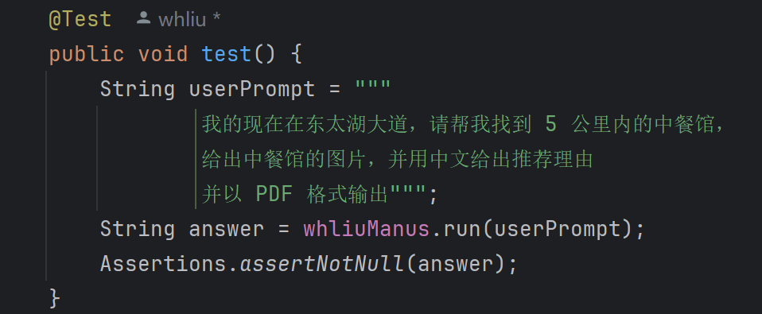
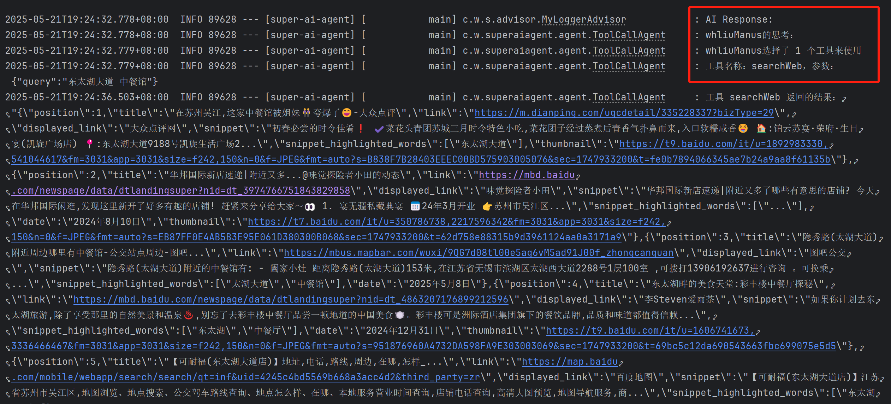
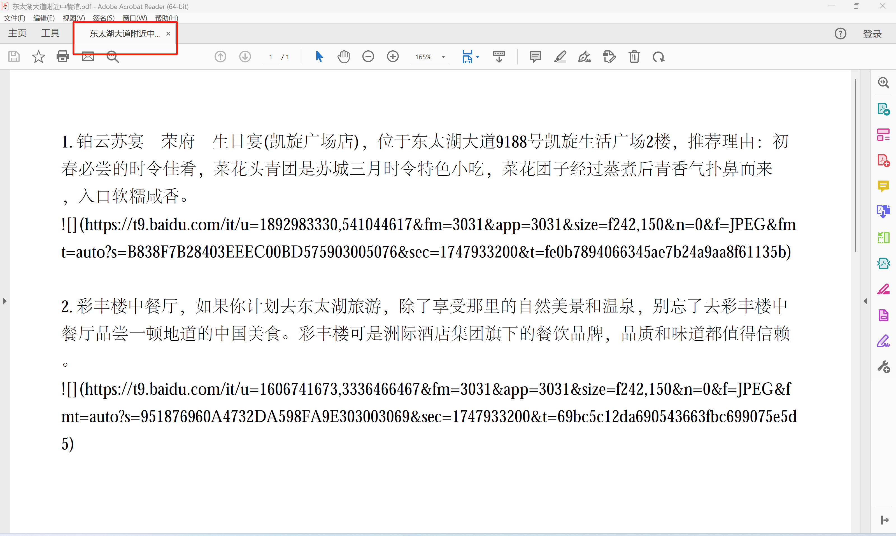

# 介绍
炫技项目，手搓Manus智能体、MCP server、MCP Client、离线RAG、Function Call等，用代码揭开LLM开发的真面目。
# 环境
- Spring AI
- SpringBoot 3 
- JDK21

# 智能体实现效果
### 可以自主调用本地实现的MCP服务中的工具，自主思考，最终给出结果

### 执行过程，智能体可以自主思考调用什么工具，并根据工具调用返回的结果来决定下一步的策略：

### 生成PDF结果（markdown格式，图片加载有问题）：

### 图片链接可以打开：

# 目前已完成功能
- 自定义拦截器（Advisor）
- 违禁词校验Advisor
- 专用模板类，从文件加载模板
- 自定义ChatMemory
- 结构化输出转换器
- 对话记忆持久化
- 本地RAG
- 在线RAG
- 向量数据库
- 文档检索器
- 上下文查询增强器
- function call开发
- MCP开发（sse和stdio）
- 自定义Manus智能体

# TODO
- 权限校验
- 自定义对话记忆，持久化对话到MySQL、Redis中
- 自定义DocumentReader，读取Github仓库信息
- 自定义QueryTransformer查询转换器，使用第三方翻译API代替大模型翻译
- 实现基于向量数据库和其他数据库的混合检索（MySQL、Redis、ES）
- 自动发送邮件tool
- 优化PDF生成，本地存储图片
- 手动控制ToolCallingManager执行流程
- 实现env环境变量传递参数，多agent工作流